# DEV-PULSE Backend — High-Level Design (HLD)

> **Version:** 1.0 (Phase 1)  
> **Date:** 2026-07-20  
> **Scope:** Backend only — FastAPI + LangGraph pipeline

---

## 1. System Context

DEV-PULSE is an AI-powered Technical Excellence Intelligence Platform that evaluates individual developer contributions on GitHub repositories and generates actionable improvement reports.

### Actors

| Actor | Description |
|-------|-------------|
| **Engineering Manager** | Triggers analysis via React dashboard; consumes scores and AI reports |
| **GitHub** | Source of truth for developer activity (commits, PRs, reviews, branches) |
| **Hugging Face LLM** | Generates the Technical Excellence Report (structured JSON) |

### System Context Diagram



---

## 2. High-Level Architecture



---

## 3. Technology Stack

| Layer | Technology | Purpose |
|-------|-----------|---------|
| Runtime | Python 3.14 | Application language |
| Web Framework | FastAPI + Uvicorn | Async HTTP API |
| Orchestration | LangGraph (langgraph) | Stateful pipeline with checkpointing |
| MCP SDK | `mcp` (Python) | Communication with GitHub MCP Server |
| MCP Server | `@modelcontextprotocol/server-github` (npx) | GitHub data access via MCP protocol |
| LLM Integration | `langchain_huggingface` | Chat completion with structured output |
| Data Validation | Pydantic v2 | Request/response schemas, domain models |
| Retry | Tenacity | Exponential backoff for HF rate limits |
| Config | python-dotenv | Environment variable management |

---

## 4. Data Flow

The `/api/v1/analyze` endpoint triggers a **sequential 6-node LangGraph pipeline**:



| Step | Node | Input | Output |
|------|------|-------|--------|
| 1 | `fetch_github_data` | owner, repo, username | Raw GitHub JSON (commits, PRs, reviews, branches) |
| 2 | `normalize_data` | Raw JSON | `List[GenericActivity]` |
| 3 | `extract_metrics` | Activities | `MetricsResult` (6 KPIs, each 0–100) |
| 4 | `calculate_score` | Metrics | `technical_score` (0–100) + `grade` (A–D) |
| 5 | `generate_ai_report` | Score + Metrics + Context | `AIReport` (strengths, weaknesses, recommendations, learning) |
| 6 | `persist_to_db` | All state | Logged (placeholder) |

---

## 5. API Surface

### `GET /api/v1/health`

Returns `{ "status": "ok" }`. Used by frontend for connectivity check.

### `POST /api/v1/analyze`

**Request:**
```json
{
  "owner": "octocat",
  "repo": "Hello-World",
  "github_username": "octocat",
  "employee_id": "EMP-001",
  "name": "The Octocat"
}
```

**Response (success):**
```json
{
  "status": "success",
  "technical_score": 72,
  "grade": "B",
  "metrics": {
    "commit_frequency": 85.0,
    "pr_participation": 60.0,
    "code_review_participation": 70.0,
    "documentation_contribution": 45.0,
    "branch_hygiene": 80.0,
    "repository_contribution": 55.0
  },
  "ai_report": {
    "strengths": ["..."],
    "weaknesses": ["..."],
    "recommendations": ["..."],
    "learning": ["..."]
  }
}
```

---

## 6. Key Design Decisions

| Decision | Rationale |
|----------|-----------|
| **MCP over REST** | GitHub MCP Server provides tool-level abstraction; decouples from GitHub REST API versioning; extensible to future MCP connectors (Jira, Azure) |
| **LangGraph for orchestration** | Provides checkpointing (MemorySaver), conditional branching on error, tracing via LangSmith, and a clear state machine model |
| **Generic Activity Model** | A single normalized schema for all activities enables future integrations without changing downstream processing |
| **Hugging Face over OpenAI** | Cost-effective inference; model-agnostic via `langchain_huggingface` |
| **Pydantic structured output** | LLM responses are parsed into typed `AIReport` objects with fallback JSON extraction |
| **No raw data persistence** | Only processed results are stored (Phase 2); raw GitHub data is ephemeral |

---

## 7. Security

| Aspect | Implementation |
|--------|----------------|
| **Authentication** | GitHub PAT and HF API token stored in `.env`, never committed |
| **CORS** | Permissive (`allow_origins=["*"]`) in Phase 1; to be restricted in production |
| **Input Validation** | Pydantic models enforce type constraints on all request payloads |
| **Error Handling** | Internal errors return HTTP 502 with detail message; stack traces logged server-side only |
| **Transport** | MCP uses local stdio (no network exposure); HF uses HTTPS |

---

## 8. Deployment (Phase 1)

- **Single process**: `uvicorn src.app.app:app --reload`
- **Dependencies**: `npx` must be available for MCP server spawning
- **Environment**: `.env` file at project root with `GITHUB_PERSONAL_ACCESS_TOKEN` and `HUGGINGFACEHUB_API_TOKEN`
- **Future**: Docker Compose with PostgreSQL, Redis (caching), and Nginx reverse proxy

---

## 9. Phase 2 Roadmap (Out of Scope)

- Real PostgreSQL persistence
- Additional MCP connectors (Azure Boards, SonarQube, Jira)
- New metrics: test coverage, build quality, sprint velocity
- Team-level aggregation and historical trending
- Role-based access control (RBAC)
