# DEV-PULSE Backend — Low-Level Design (LLD)

> **Version:** 1.0 (Phase 1)  
> **Date:** 2026-07-20  
> **Scope:** Backend module internals, class design, algorithms

---

## 1. Module Structure

```
backend/
├── src/
│   └── app/
│       ├── app.py                  # FastAPI application & routes
│       ├── core/
│       │   ├── config.py           # Settings (env vars)
│       │   ├── models.py           # Domain models + LangGraph state
│       │   ├── mcp_client.py       # GitHub MCP client (stdio)
│       │   └── workflow.py         # LangGraph StateGraph (6 nodes)
│       ├── service/
│       │   ├── normalizer.py       # Raw → GenericActivity (delegates to analytics)
│       │   ├── metrics.py          # GenericActivity → MetricsResult (6 KPIs)
│       │   ├── scoring.py          # MetricsResult → (score, grade)
│       │   └── ai_report.py        # Metrics + context → AIReport via HF LLM
│       └── db/
│           └── repository.py       # Placeholder persistence (logs only)
```

---

## 2. Class Diagram



### Analytics Module Classes

*(Class diagram included in the image above)*

---

## 3. Service Layer Contracts

### 3.1 `service/normalizer.py`

```python
def normalize(
    raw_data: Dict[str, Any],   # Keys: commits, pull_requests, reviews, branches
    employee_id: str,
    github_username: str,
) -> List[GenericActivity]
```

**Responsibility:** Flattens raw MCP responses into payloads, delegates to `DataNormalizer.normalize_batch()`, maps analytics `Activity` objects to core `GenericActivity`.

**Mapping:** `analytics.REPOSITORY` / `analytics.BRANCH` → `core.BRANCH`

---

### 3.2 `service/metrics.py`

```python
def extract_metrics(activities: List[GenericActivity]) -> MetricsResult
```

**Responsibility:** Filters activities by type and computes 6 KPIs:

| Metric | Formula | Baseline (100%) |
|--------|---------|-----------------|
| Commit Frequency | `count(commits) / 30 × 100` | 30 commits |
| PR Participation | `count(PRs) / 10 × 100` | 10 PRs |
| Code Review Participation | `count(reviews) / 10 × 100` | 10 reviews |
| Documentation Contribution | `total_pr_body_chars / 2000 × 100` | 2000 chars |
| Branch Hygiene | `well_named_branches / total_branches × 100` | Convention-based |
| Repository Contribution | `avg_changed_files_per_PR × 20` | 5 files avg |

All values clamped to `[0, 100]`.

**Branch naming heuristic:** Prefixes `main`, `master`, `develop`, `feature/`, `fix/`, `hotfix/`, `release/`, `chore/`, `docs/`.

---

### 3.3 `service/scoring.py`

```python
def calculate_score(metrics: MetricsResult) -> tuple[int, str]
```

**Responsibility:** Applies weighted sum and assigns grade.

**Weight Table:**

| Metric | Weight |
|--------|--------|
| commit_frequency | 20% |
| pr_participation | 20% |
| code_review_participation | 15% |
| documentation_contribution | 15% |
| branch_hygiene | 15% |
| repository_contribution | 15% |

**Grade Thresholds (legacy):**

| Grade | Score Range |
|-------|-------------|
| A | 85–100 |
| B | 70–84 |
| C | 55–69 |
| D | 0–54 |

**Grade Thresholds (TechnicalScorer — analytics module):**

| Grade | Score Range |
|-------|-------------|
| A | 90–100 |
| B | 80–89 |
| C | 70–79 |
| D | 60–69 |
| F | 0–59 |

The service tries the new `TechnicalScorer` first and falls back to legacy on import or runtime error.

---

### 3.4 `service/ai_report.py`

```python
async def generate_report(
    developer_name: str,
    score: int,
    grade: str,
    metrics: MetricsResult,
    repo_name: str,
) -> AIReport
```

**Responsibility:** Constructs a system prompt with metrics context, calls Hugging Face `Qwen/Qwen2.5-7B-Instruct` via `ChatHuggingFace`, parses structured JSON output into `AIReport`.

**Retry Strategy:** `tenacity` — retry on `HfHubHTTPError`, exponential backoff (30s–300s), max 5 attempts.

**Parsing:** `PydanticOutputParser` → fallback raw `{...}` extraction from response content.

---

## 4. MCP Client Design



**Key Details:**

- **Transport:** stdio — spawns `npx -y @modelcontextprotocol/server-github` as child process
- **Auth:** `GITHUB_PERSONAL_ACCESS_TOKEN` passed as env var to subprocess
- **Tool call with fallback:** `_call_tool(session, name, args, fallback_name)` — if primary tool fails, retries with alternate name
- **PR pagination fallback:** Tries `per_page=100`, then 30, then 10 to handle Zod validation errors on deleted fork PRs
- **Client-side author filter:** `list_commits` doesn't support `author` param — filters by `author.login` or `commit.author.name` post-fetch
- **Branches:** Not supported by npm MCP server; returns empty list

---

## 5. LangGraph Workflow — Detailed Flowchart



**Checkpointing:** `MemorySaver` (in-memory) — enables replay and debugging. Each invocation uses a unique `thread_id` (UUID4).

**State mutations:** Each node returns a partial dict that gets merged into `DevPulseState`.

---

## 6. Error Handling Strategy

| Layer | Error | Handling |
|-------|-------|----------|
| MCP Client | `BaseExceptionGroup` (anyio TaskGroup) | Unwrap to first exception, log, set `state["error"]` |
| MCP Client | Tool call failure | Try fallback tool name; raise if both fail |
| MCP Client | PR Zod validation | Retry with smaller `per_page`; return `[]` on exhaustion |
| LangGraph | `state["error"]` set after fetch | Conditional edge → `END` (abort pipeline) |
| AI Report | `HfHubHTTPError` (rate limit) | Tenacity retry: 5 attempts, 30–300s exponential backoff |
| LangGraph | `state["error"]` set after report | Conditional edge → `END` (abort pipeline) |
| FastAPI | `final.get("error")` truthy | Return HTTP 502 with detail message |

---

## 7. Configuration

```python
class Settings:
    huggingface_api_token: str   # HUGGINGFACEHUB_API_TOKEN
    huggingface_model: str       # default: "Qwen/Qwen2.5-7B-Instruct"
    github_token: str            # GITHUB_PERSONAL_ACCESS_TOKEN
    test_repo: str               # TEST_GITHUB_REPO (for E2E tests)
    test_username: str           # TEST_GITHUB_USERNAME (for E2E tests)
```

`.env` file resolved via `dotenv` from 4 directories above `config.py` (project root).

---

## 8. Database Repository (Placeholder)

```python
class DevPulseRepository:
    async def save_employee(employee: Employee) -> None       # logs only
    async def save_score(employee_id, score, grade) -> None   # logs only
    async def save_report(employee_id, report) -> None        # logs only
    async def get_employee(employee_id) -> Optional[Employee] # returns None
```

**Phase 2 target:** PostgreSQL with SQLAlchemy async, Alembic migrations, and proper CRUD.

---

## 9. Request/Response Flow (FastAPI Layer)


**Schemas:**

| Schema | Fields |
|--------|--------|
| `AnalyzeRequest` | owner, repo, github_username, employee_id?, name? |
| `AnalyzeResponse` | status, technical_score?, grade?, metrics?, ai_report?, error? |
| `MetricsResponse` | 6 float fields (mirrors MetricsResult) |
| `ReportResponse` | strengths, weaknesses, recommendations, learning (all `List[str]`) |

---

## 10. Thread Safety & Concurrency

- **FastAPI** runs async on a single event loop (uvicorn); each request gets its own coroutine
- **LangGraph** `dev_pulse_graph` is a module-level singleton; `ainvoke` is coroutine-safe with unique `thread_id` per call
- **MCP Client** spawns a new subprocess per invocation (no shared state)
- **HF LLM** is instantiated per-call inside `generate_report` (stateless)
- **No shared mutable state** between requests
