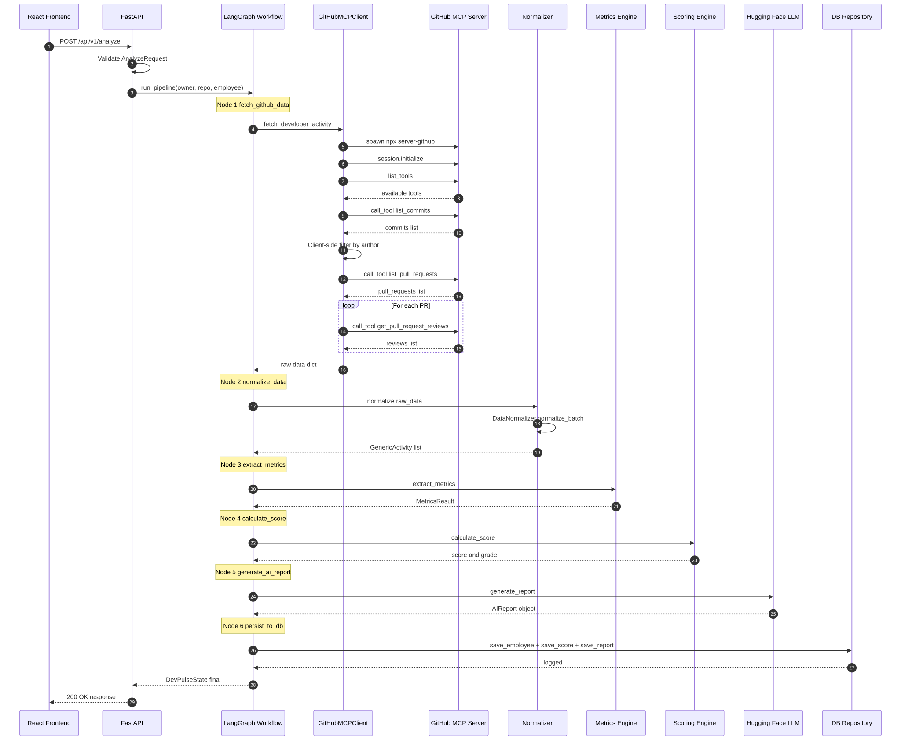
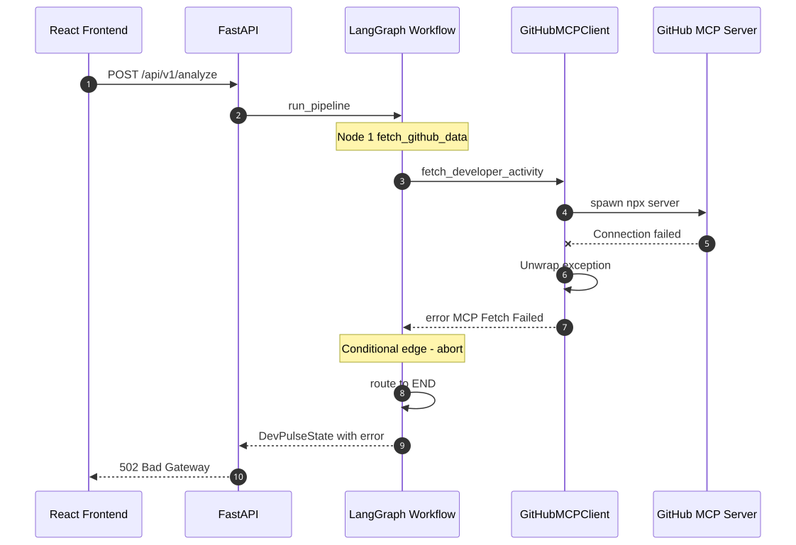
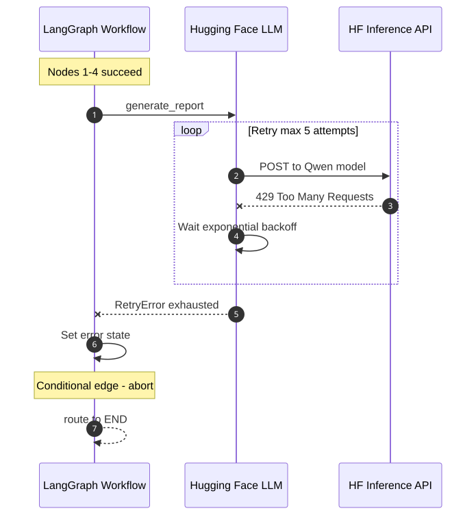

# DEV-PULSE Backend - Sequence Diagrams

> **Version:** 1.0 (Phase 1)
> **Date:** 2026-07-20

---

## 1. Happy Path - Full Analyze Pipeline



**Steps:**
1. Client sends `POST /api/v1/analyze` with owner, repo, github_username
2. FastAPI validates request and calls `run_pipeline()`
3. LangGraph executes 6 nodes sequentially: fetch → normalize → metrics → score → AI report → persist
4. GitHub MCP Server is called via stdio for commits, PRs, reviews
5. Hugging Face LLM generates structured AI report
6. Response returned with score, grade, metrics, and AI report

---

## 2. Error Flow - MCP Fetch Failure



**Steps:**
1. Client sends analyze request
2. MCP client fails to connect to GitHub MCP Server (network/auth error)
3. `BaseExceptionGroup` is unwrapped to root cause
4. Error channel set in state → conditional edge routes to END
5. FastAPI returns HTTP 502 with error detail

---

## 3. Error Flow - Hugging Face Rate Limit Exhaustion



**Steps:**
1. Nodes 1-4 (fetch, normalize, metrics, score) succeed
2. AI report generation hits HF rate limit (429)
3. Tenacity retries with exponential backoff: 30s, 60s, 120s, 240s, 300s
4. After 5 failed attempts, `RetryError` is caught
5. Error channel set → conditional edge routes to END
6. FastAPI returns HTTP 502

---

## 4. Internal - LangGraph State Machine Transitions



**States:**
- `fetch_github_data` → entry point, can abort on error
- `normalize_data` → `extract_metrics` → `calculate_score` → linear chain
- `generate_ai_report` → can abort on error (rate limit)
- `persist_to_db` → terminal node before END

---

## 5. Diagram Source Files

All diagram sources are in `docs/architecture/images/*.mmd` (Mermaid format).
To regenerate PNGs:

```bash
cd docs/architecture/images
npx -y @mermaid-js/mermaid-cli -i <file>.mmd -o <file>.png -b white
```
